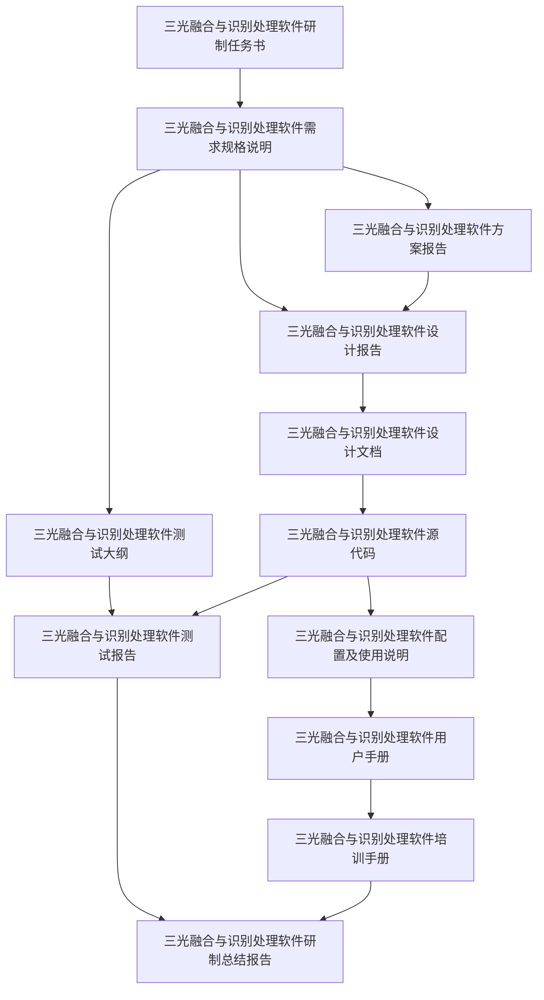

# 三光融合与识别处理软件文档管理中心

## 📋 文档概览

本项目包含软件研制全生命周期的12个核心文档，按照时间顺序和逻辑关系组织，确保文档间的完整追踪性。

## 🗂️ 文档列表

### 📅 按时间顺序

| 序号  | 文档名称                   | 完成日期        | 状态  | 关联文档                                                               |
| --- | ---------------------- | ----------- | --- | ------------------------------------------------------------------ |
| 1   | [[三光融合与识别处理软件研制任务书]]   | 2024年4月1日   | ✅   | → [[三光融合与识别处理软件方案报告]]、[[三光融合与识别处理软件需求规格说明]]                        |
| 2   | [[三光融合与识别处理软件需求规格说明]]  | 2024年4月9日   |     | ← [[三光融合与识别处理软件研制任务书]] → [[三光融合与识别处理软件方案报告]]、[[三光融合与识别处理软件设计报告]]   |
| 3   | [[三光融合与识别处理软件方案报告]]    | 2024年4月30日  |     | ← [[三光融合与识别处理软件研制任务书]]、[[三光融合与识别处理软件需求规格说明]] → [[三光融合与识别处理软件设计报告]] |
| 4   | [[三光融合与识别处理软件设计报告]]    | 2024年6月8日   |     | ← [[三光融合与识别处理软件方案报告]]、[[三光融合与识别处理软件需求规格说明]] → [[三光融合与识别处理软件设计文档]]  |
| 5   | [[三光融合与识别处理软件设计文档]]    | 2024年6月10日  |     | ← [[三光融合与识别处理软件设计报告]] → [[三光融合与识别处理软件源代码]]                         |
| 6   | [[三光融合与识别处理软件测试大纲]]    | 2024年10月10日 |     | ← [[三光融合与识别处理软件需求规格说明]] → [[三光融合与识别处理软件测试报告]]                      |
| 7   | [[三光融合与识别处理软件源代码]]     | 2024年10月12日 | ✅   | ← [[三光融合与识别处理软件设计文档]] → [[三光融合与识别处理软件测试报告]]                        |
| 8   | [[三光融合与识别处理软件测试报告]]    | 2024年10月12日 | ✅   | ← [[三光融合与识别处理软件测试大纲]]、[[三光融合与识别处理软件源代码]] → [[三光融合与识别处理软件研制总结报告]]   |
| 9   | [[三光融合与识别处理软件测试计划]]    | 2024年10月12日 | ✅   |                                                                    |
| 10  | [[三光融合与识别处理软件测试记录]]    | 2024年10月12日 | ✅   |                                                                    |
| 11  | [[三光融合与识别处理软件测试说明]]    | 2024年10月12日 | ✅   |                                                                    |
| 12  | [[三光融合与识别处理软件配置及使用说明]] | 2024年10月13日 |     | ← [[三光融合与识别处理软件源代码]] → [[三光融合与识别处理软件用户手册]]                         |
| 13  | [[三光融合与识别处理软件用户手册]]    | 2024年10月14日 |     | ← [[三光融合与识别处理软件配置及使用说明]] → [[三光融合与识别处理软件培训手册]]                     |
| 14  | [[三光融合与识别处理软件培训手册]]    | 2024年10月14日 |     | ← [[三光融合与识别处理软件用户手册]] → [[三光融合与识别处理软件研制总结报告]]                      |
| 15  | [[三光融合与识别处理软件研制总结报告]]  | 2024年10月15日 |     | ← 所有文档                                                             |
|     |                        |             |     |                                                                    |

## 🔄 文档生命周期阶段

### 需求分析阶段 (2024.4.1 - 2024.4.30)

- [[三光融合与识别处理软件研制任务书]] - 项目启动文档
- [[三光融合与识别处理软件需求规格说明]] - 需求详细描述
- [[三光融合与识别处理软件方案报告]] - 技术方案确定

### 设计阶段 (2024.6.8 - 2024.6.10)

- [[三光融合与识别处理软件设计报告]] - 总体设计
- [[三光融合与识别处理软件设计文档]] - 详细设计

### 实现与测试阶段 (2024.10.10 - 2024.10.12)

- [[三光融合与识别处理软件测试大纲]] - 测试策略规划
- [[三光融合与识别处理软件源代码]] - 代码实现
- [[三光融合与识别处理软件测试报告]] - 测试执行结果

### 交付阶段 (2024.10.13 - 2024.10.15)

- [[三光融合与识别处理软件配置及使用说明]] - 部署配置
- [[三光融合与识别处理软件用户手册]] - 用户指导
- [[三光融合与识别处理软件培训手册]] - 培训材料
- [[三光融合与识别处理软件研制总结报告]] - 项目总结

## 📊 追踪性矩阵

### 需求追踪

## 🔗 快速导航

### 按文档类型

- **规划文档**: [[三光融合与识别处理软件研制任务书]]、[[三光融合与识别处理软件方案报告]]
- **需求文档**: [[三光融合与识别处理软件需求规格说明]]
- **设计文档**: [[三光融合与识别处理软件设计报告]]、[[三光融合与识别处理软件设计文档]]
- **测试文档**: [[三光融合与识别处理软件测试大纲]]、[[三光融合与识别处理软件测试报告]]
- **交付文档**: [[三光融合与识别处理软件源代码]]、[[三光融合与识别处理软件配置及使用说明]]、[[三光融合与识别处理软件用户手册]]、[[三光融合与识别处理软件培训手册]]
- **总结文档**: [[三光融合与识别处理软件研制总结报告]]

### 按相关性

- **技术线**: [[三光融合与识别处理软件方案报告]] → [[三光融合与识别处理软件设计报告]] → [[三光融合与识别处理软件设计文档]] → [[三光融合与识别处理软件源代码]]
- **测试线**: [[三光融合与识别处理软件需求规格说明]] → [[三光融合与识别处理软件测试大纲]] → [[三光融合与识别处理软件测试报告]]
- **用户线**: [[三光融合与识别处理软件源代码]] → [[三光融合与识别处理软件配置及使用说明]] → [[三光融合与识别处理软件用户手册]] → [[三光融合与识别处理软件培训手册]]

## 📝 文档管理规范

### 命名规范

- 所有文档使用中文名称
- 使用双括号 `[[]]` 创建内部链接
- 保持文档名称与实际文件名一致

### 链接规范

- **正向链接**: 当前文档引用的其他文档
- **反向链接**: 引用当前文档的其他文档
- **相关链接**: 同阶段或相关主题的文档

### 版本控制

- 每个文档在页面顶部标注版本信息
- 重要变更记录在文档变更历史中
- 关联文档需要同步更新引用

## 🎯 使用建议

1. **创建新文档时**：
    
    - 从相应的模板开始
    - 在文档开头添加元信息（日期、版本、关联文档）
    - 建立双向链接关系
2. **更新文档时**：
    
    - 检查是否影响关联文档
    - 更新追踪性矩阵
    - 通知相关文档的维护者
3. **查找信息时**：
    
    - 使用本页面的快速导航
    - 利用Obsidian的图谱视图查看文档关系
    - 使用标签和搜索功能定位内容

## 📱 Obsidian插件推荐

- **Dataview**: 自动生成文档统计和关系表
- **Graph Analysis**: 分析文档关系图
- **Tag Wrangler**: 管理文档标签
- **Templater**: **创建文档模板**