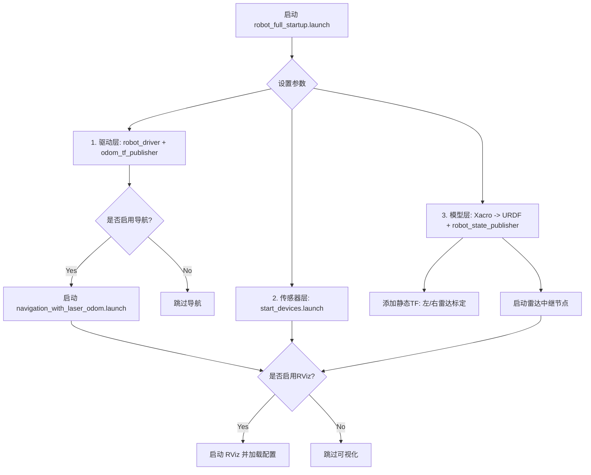

这个 `robot_full_startup.launch` 文件是一个典型的 ROS（机器人操作系统）主启动文件，旨在一次性启动三轮机器人的所有核心功能模块。

根据你提供的 XML 内容，它按逻辑顺序执行了以下 **5 个主要步骤**：

### 1. 定义启动参数 (Arguments)

文件首先定义了三个可配置的参数，允许用户在启动时通过命令行覆盖默认值：

- **`use_navigation`**: 默认为 `true`。决定是否启动导航栈（路径规划、避障等）。
- **`use_rviz`**: 默认为 `true`。决定是否打开可视化界面 RViz。
- **`rviz_config`**: 指定 RViz 的配置文件路径。只有当 `use_rviz` 为真时才生效，默认指向 `robot_description` 包下的 `robot_navigation.rviz`。

---

### 2. 启动机器人驱动与里程计系统 (Robot Driver & Odometry)

这是机器人的“运动神经”部分，负责控制底盘并计算位置。

- **加载底层驱动**: 包含 (`include`) 了 `robot_driver` 包中的 `robot_driver.launch`。这通常负责连接硬件（如电机控制器），发布速度命令 (`cmd_vel`) 并读取编码器数据。
- **发布里程计和 TF**: 启动了一个名为 `odom_tf_publisher` 的 Python 节点 (`odom_tf_publisher.py`)。
    - **作用**: 它根据编码器数据计算机器人的里程计 (`odom`) 并发布 `odom` -> `base_link` 的坐标变换 (TF)。
    - **关键配置**: 设置参数 `invert_yaw` 为 `false`。注释说明里程计数据已经被外部节点 (`odom_corrector`) 修正过方向，因此这里不需要再反转偏航角。

---

### 3. 启动传感器系统 (Sensors)

- **加载设备驱动**: 包含 (`include`) 了 `start_devices.launch`。
    - **作用**: 这个文件通常负责启动具体的传感器硬件驱动，例如激光雷达 (LiDAR)、IMU (惯性测量单元)、摄像头等。具体的设备列表需要查看 `start_devices.launch` 的内容。

---

### 4. 发布机器人模型与坐标系 (Robot Model & TF)

这是机器人的“骨架”部分，让系统知道机器人的形状和各部件的相对位置。

- **加载 URDF 模型**: 使用 `xacro` 工具解析 `tricycle_robot.xacro` 文件，并将生成的完整 URDF 模型加载到参数服务器 (`robot_description`)。
- **发布状态**:
    - **`robot_state_publisher`**: 订阅关节状态，根据 URDF 自动计算并发布除根节点外的所有静态和动态连杆的 TF 变换（频率 50Hz）。
    - **`joint_state_publisher`**: 发布关节状态信息。由于 `use_gui` 设为 `false`，它不会弹出滑块界面，而是发布全零的关节角度或依赖其他节点提供的数据。
- **手动定义静态坐标变换 (Static Transforms)**:
    - **左雷达 (`livox_left_tf`)**: 定义了从 `lidar_link` 到 `livox_left` 的精确位置和姿态（基于标定数据：平移 x,y,z 和 旋转 r,p,y）。
    - **右雷达 (`livox_right_tf`)**: 定义了从 `lidar_link` 到 `livox_right` 的精确位置和姿态。
    - _注意_: 这里的旋转角度已经是弧度制（例如 `-3.13547` 约等于 -180 度）。
- **雷达数据中继**: 启动 `livox_frame_relay.py` 节点。
    - **作用**: 这是一个自定义脚本，可能用于处理 Livox (MID360) 雷达的特殊数据格式，或者将多个雷达的点云合并/重映射到统一的坐标系中。

---

### 5. 可选功能组 (Optional Groups)

根据第 1 步定义的参数，有条件地启动高级功能：

- **导航系统 (如果 `use_navigation` 为 true)**:
    
    - 包含 `robot_navigation` 包中的 `navigation_with_laser_odom.launch`。
    - **作用**: 启动 SLAM 建图或自主导航栈 (Move_base)，利用激光雷达和里程计进行定位和路径规划。
- **可视化界面 (如果 `use_rviz` 为 true)**:
    
    - 启动 `rviz` 节点。
    - **作用**: 打开图形化界面，加载指定的 `.rviz` 配置文件，用于实时显示雷达点云、机器人模型、路径规划结果、摄像头图像等。

### 总结流程图

**潜在问题提示：** 在代码片段中，`<param name="invert_yaw" value="false"/>` 这一行直接放在了 `<node ... />` 标签之外（但在 `<include>` 之后）。在标准的 ROS launch 语法中，`<param>` 通常需要包裹在 `<node>` 内部作为子标签，或者放在 `<group>` 中作为全局参数。

- 如果它是想作为 `odom_tf_publisher` 节点的参数，它应该缩进在 `<node name="odom_tf_publisher" ...>` 标签内部。
- 目前的写法可能会导致该参数无法正确传递给节点，或者被解析为全局参数（取决于具体的 ROS 版本和解析器容错性）。建议检查该参数是否成功加载到了 `/odom_tf_publisher/invert_yaw`。